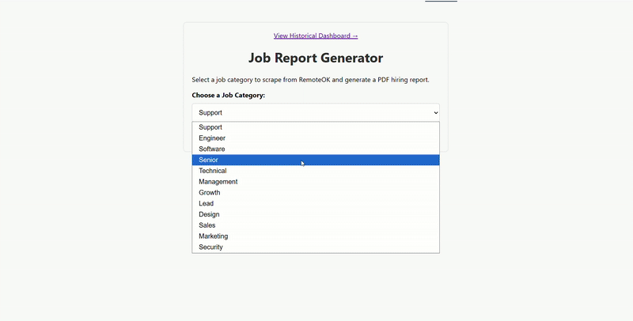

# Remote Job Market Analyzer & Reporter


**A full-stack data application that turns chaotic job boards into actionable intelligence.** This project performs on-demand scraping of live RemoteOK listings, utilizes an LLM to generate executive summaries, and compiles everything into a professional PDF report.

---

## 🚀 Live Demo & Output

**The application is deployed live on Hugging Face Spaces!**

### 👉 [**Click here to use the Live Application**](https://huggingface.co/spaces/Karthix1/job-market-analyzer) 👈


<p align="center">

</p>

---

## 🛠️ Tech Stack & Key Features

| Tech                        | Role                                                  |
| :-------------------------- | :---------------------------------------------------- |
| **Python**                  | Core backend logic.                                   |
| **Flask**                   | Web server and API endpoint.                          |
| **Selenium**                | Dynamic, headless browser scraping.                   |
| **Pandas**                  | Data cleaning, transformation, and analysis.          |
| **SQLite**                  | Persistent database for historical data.              |
| **OpenRouter / Mistral 7B** | Generative AI for trend summarization.                |
| **Matplotlib / Seaborn**    | Data visualization and chart generation.              |
| **FPDF2**                   | Professional PDF report generation.                   |
| **Docker**                  | Containerization for portable, consistent deployment. |
| **GitHub Actions**          | CI/CD for automated daily data collection.            |

---

## 🏗️ System Architecture

The application follows an ETL (Extract, Transform, Load) pipeline triggered via a web frontend, with a separate, scheduled CI/CD pipeline for continuous data enrichment.

[](https://mermaid.live/edit#pako:eNp1U11v2jAU_SuWnzaJIkhIgDxMArJ21UBlkG7SQh8u5DZYc-zIcdQC4b_v5qOaNnWRYvv6nnM_ju0LP-gEecBTA_mRReFOMfoeCzRxPTyxm5tP1RYlHmzBFmAx1eZUscf7-FZC8Yv9wD0ZTx3tvoFHRqQpmqJiszy_rEAottDKGi0lmmsLbcei3LeJd_xztGRrkaMUCne8dRO9CTjss-2BcFh1s4nrkpQoMzbXtsveuRrGHVr2JVotq7rAeIOZtvjw9R3gBl5YCBYqtpAIiiKvQSVQtKZQacfpvK0c1pQHWxpMOmo4jz9svy2FxWZjDwV-7Hiokv80vMFcG0sZ_u3W6bOZAnk6U7vL5Sp-yFFtdGkp-2z9JnU4b7C1rvhquzoI3Xpp0VZaZhmYE4sIU7F1eBvTz-6QOgGrzd-xthYsndl3cY5XYHOprRT7DkKbbb4jmBpEYd7trw5f40L9oqSGpGquEu_R_RIJD0g47PEMTQa1yS81a8ftETM69ICWCT5DKW2tyZVoOaifWmdvTKPL9MiDZ5AFWWWe0IUMBZCkfyBUEZqFLpXlgTtsQvDgwl954Eycvj_03ZHrjceO509HPX7igd93XdcZea7ne87Ucd1rj5-bpIP-ZOAOpmPfG_vOwJsM_B7HRJByq_bVNI_n-hv1mwjr)

---

## 🔄 CI/CD: Automated Daily Data Enrichment

This project uses a **GitHub Actions workflow** (`.github/workflows/daily_scrape.yml`) to automatically run the scraper every 24 hours.

- **Trigger:** Runs on a CRON schedule (`0 5 * * *`).
- **Process:** The workflow spins up a runner, installs Chrome and all dependencies, and runs the `scheduled_scraper.py` script.
- **Persistence:** Upon completion, the Action commits the updated `jobs.db` file back to the repository, ensuring the live application's data is always growing.

---

## 🐳 Deployment

The application is fully containerized using **Docker** for maximum portability and reproducibility.

- The `Dockerfile` defines the complete environment, installing Python, Google Chrome, and all necessary dependencies.
- The container is deployed as a **Hugging Face Space**, which provides a persistent filesystem for the SQLite database and handles secret management for the API key.

---

## 📂 Project Structure

```text
/
├── .github/workflows/daily_scrape.yml # CI/CD automation workflow
├── app.py                             # Flask entry point and route handlers
├── scheduled_scraper.py               # Script for the automated daily run
├── Dockerfile                         # Defines the container environment
├── install_chrome.sh                  # Helper script for Docker setup
├── requirements.txt                   # Python dependencies
├── .env.example                       # Template for environment variables
├── README.md                          # You are here!
|
├── /data/                             # (Created automatically, gitignored)
├── /reports/                          # (Created automatically, gitignored)
├── /static/                           # (Created automatically, gitignored)
|
├── /fonts/
│   └── DejaVuSans.ttf                 # Unicode font for PDF generation
└── /templates/
    ├── index.html                     # Main user interface
    └── dashboard.html                 # Historical data dashboard
```

---

## 🚀 Getting Started Locally

### Prerequisites

- Python 3.9+
- Docker Desktop (for a fully containerized run)

### 1. Clone & Setup

```bash
git clone https://github.com/Krasper707/job-scraper.git
cd job-scraper
python -m venv venv
# Activate the virtual environment (use `venv\Scripts\activate` on Windows)
source venv/bin/activate
pip install -r requirements.txt
```

### 2. Configure API Key

Create a file named `.env` in the root directory and add your key:

```ini
# .env (This file is gitignored for security)
OPENROUTER_API_KEY="sk-or-v1-YOUR_KEY_HERE"
```

### 3. Run the Application

You can run it as a standard Flask app or as a Docker container.

**A) Standard Flask Run:**

```bash
python app.py
```

**B) Docker Run:**

```bash
# 1. Build the image
docker build -t job-analyzer .

# 2. Run the container
docker run -d -p 5000:7860 --env-file .env -v "$(pwd)/data:/app/data" --name job-analyzer-app job-analyzer
```

Access the application at `http://localhost:5000`.

---

## 🔮 Future Roadmap

- [ ] **Dashboard Enhancements:** Add more complex visualizations (e.g., skill correlations) using Plotly for interactivity.
- [ ] **Multi-Source Scraping:** Refactor the scraper into a class-based system to support multiple job boards (e.g., LinkedIn, Indeed).
- [ ] **Asynchronous Task Queue:** Implement Celery/Redis to move the scraping and reporting process to a background worker, providing a non-blocking UI.
- [ ] **Email Alerts:** Schedule a weekly job that generates a report for a user-defined category and emails it automatically.
